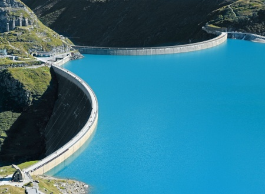
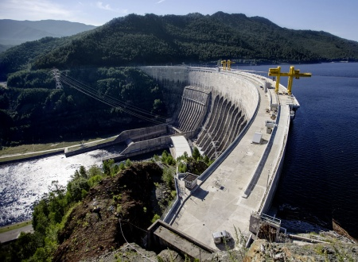
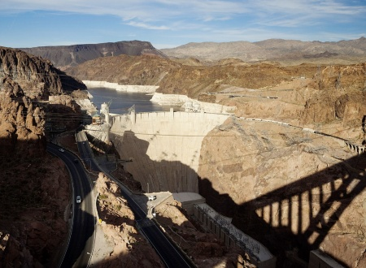
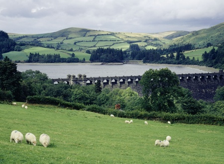

# BOWL OF PATIENCE: 7 GRAND DAMS
 
 

## The war on the Alps
- Austria

The Moserboden Reservoir lies at an altitude of 2036 m among the High Tower Ranges. A bowl of melt water coming from an area of about 100 km² is effectively supported by two dams over 100 m high, the Mosersperre and Drossensperre. This is a part of the hydraulic system that serves the Kaprunskaya HPP. Its construction began in 1939, after Austria's Anschluss, and it was supervised by Goering himself. In wartime, the dams were erected by Soviet prisoners, and since 1947 - by German and Austrian ones. Over 160 people died in this "war" with the Alps.

## Yenisei thunderstorm
- Russia

The Sayano-Shushenskaya HPP, the most powerful station in Russia with the highest dam (242 m), was built from 1963 to 1985. When the reservoir was formed, over 3 million cubic meters of forest was inundated. In 1976, a Biosphere Reserve was established in the Raion as an ecological compensation. In August 2009, 75 people died as a result of an accident at the hydropower plant. Several hydroelectric units were destroyed and turbine oil was brought to Yenisei. The restoration of the structure cost 41 billion rubles.

## Legend of Colorado
- US

The Art Deco style epochal structure on the Colorado River was built during the Great Depression (1931-1935). During the construction of the Hoover Dam, about one hundred workers died (another 42 died of pneumonia). During the first six years of the dam's operation, until Lake Mead was formed, the water almost did not reach the river delta. Due to the cessation of flooding, the number of animals and plants adapted to them has decreased dramatically. Several fish species were in danger of extinction.

## Idyll in the fields
- Great Britain

The Wernuhey River Valley in Wales was very suitable for creating a reservoir that would provide water to the English Liverpool. And in the 1880s there was built a large stone dam. As a result, the Welsh village of Llanudin was flooded. But the lake became a nature reserve, where today there are 90 bird species.

## Double stroke
- Germany

The Ronckhausen hydroelectric power plant operates on a system of two reservoirs. The lower one is formed by a dam on the shallow tributary of the Lenne River in North Rhine-Westphalia. Through a pumping tunnel almost one kilometer long, water is fed from the lower basin into the upper basin, which is 274 meters higher. Down it is discharged through two jet turbines.

## Urban history
- SOUTH AFRICA

The Molteno Dam on the slope of Table Mountain was built in 1881 to supply water to Cape Town. It replaced the previously used canals, closed for sanitary reasons, and still serves the city. There was only one incident during its operation: in the 1880s, water came out of the vault, destroyed houses and uprooted trees.

## The shiver of the earth
- Lesotho

One of the largest arched dams in Africa, Katse is part of a large water supply project in the mountainous areas of Lesotho, which includes the construction of several dams and tunnels throughout the country. Construction of the dam resulted in induced seismicity, i.e. caused a series of earthquakes. Buildings in seven villages were affected. In Mapeleng village alone 11 houses were completely destroyed. To reduce losses of rare flora the botanical garden Katse was broken in the flooded area.
